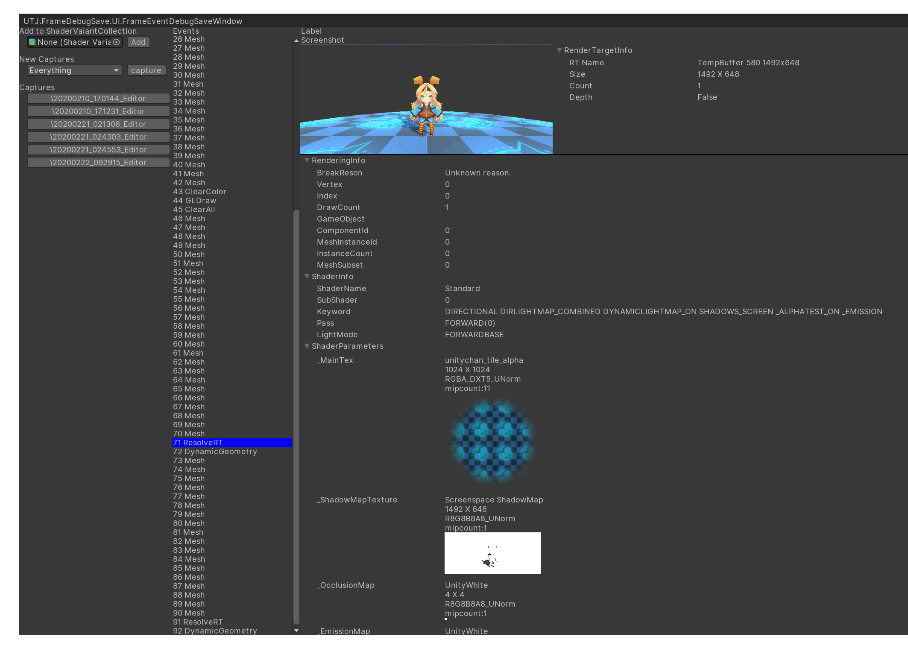
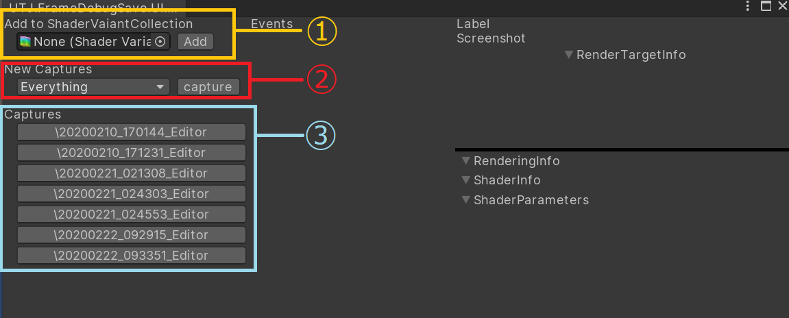

# FrameDebuggerSave

## About
This tool arrows you to capture the information of "FrameDebugger" and view the information. 
Also this tool supports to generate ShaderVariantCollection assets from captured data. 

## Install
Clone this project to the "PackageManager" Folder at UnityProject.

## Enviroment
Unity 2018.4 / Unity 2019.3 
Windows Editor and Player connected by FrameDebugger<br/ >
*Player mode doesn't supports to capture ShaderTexture and some futures.

## How to Use
Select "Tools/FrameDebuggerSave" from Menu to lauch Window.  
 

1.Add variants to ShaderVariantCollection from captured data<br/ >
Push "Add" button and then adding ShaderVariantCollection from captured data.
 
2.Data capture via FrameDebugger 
Push "Capture" button and then FrameDebugger will be launched and capture data via FrameDebugger.  

You can choose capture the textures that is used by shader, Screenshots or not by Flag. 

If the capture data will be fuge, you can reduce the datasize by switching flag.
3.Captured data List 
Click the data and then detail information will be appeared 

